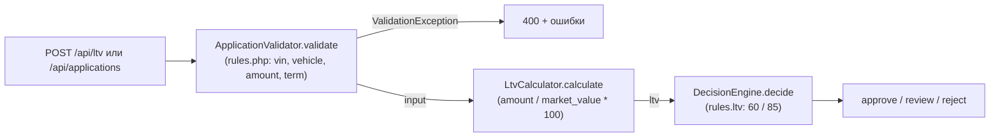

# Как считается решение approve / review / reject

Разбор по `backend/src/Domain/` и `backend/config/rules.php`.

## Участвующие файлы

`backend/config/rules.php` (числа) → `src/AppFactory.php` (сборка) → `src/Domain/AssessmentService.php` (оркестрация) → `src/Domain/ApplicationValidator.php` → `src/Domain/LtvCalculator.php` → `src/Domain/DecisionEngine.php`. Вспомогательные: `VinValidator.php`, `VehicleAge.php`, `ValidationException.php`.

## Порядок вызовов

Всё внутри `AssessmentService::assess()` (строки 28–43):

1. **Сборка** — `AppFactory::create()` (строки 27–39) подключает `config/rules.php` и создаёт: `ApplicationValidator` (с `VinValidator($rules['vin'])` и `VehicleAge(текущий год)`), `LtvCalculator`, `DecisionEngine($rules['ltv'])`, и всё это — `AssessmentService`.
2. **Валидация** — `ApplicationValidator::validate($payload)` (строки 24–83): нормализует и проверяет VIN (17 символов, без I/O/Q — из `rules['vin']`), год (`min_year` 1990, не из будущего, возраст ≤ `max_age_years` 20), пробег (0…`max_mileage_km` 500 000), стоимость (> 0), сумму (`amount.min`…`amount.max` 50 000…2 000 000), срок (`term.min_months`…`max_months` 3…48). Есть ошибки → `throw ValidationException`, дальше расчёт не идёт. Успех → нормализованный массив `input`.
3. **LTV** — `LtvCalculator::calculate($input['requested_amount'], $input['market_value'])` (строки 15–26): `round(сумма / стоимость * 100, 2)` в процентах; при нуле/отрицательных бросает `InvalidArgumentException`.
4. **Решение** — `DecisionEngine::decide($ltv)` (строки 30–41), пороги из `rules['ltv']`: `approve_max` 60.0, `review_max` 85.0:
   - `$ltv < 60.0` → `approve` (в коде строгое `<`, хотя докблок в шапке класса пишет `LTV <= approve_max` — расхождение комментария с кодом, точнее `LTV = 60.0` даёт `review`);
   - `60.0 < $ltv <= 85.0` → `review`;
   - `$ltv > 85.0` → `reject`.
5. **Ответ** — `AssessmentService::assess()` собирает массив: `vehicle_age` (через `VehicleAge::inYears`), `ltv`, `decision`, `approved_limit` (= запрошенной сумме при `approve`, иначе 0) и `input`. На решение влияют **только LTV**: `DecisionEngine` ничего, кроме `float $ltv`, не получает.

## Куда встало бы правило «пробег ≤ 400 000 км, иначе review»

Правило — не валидация, а фактор решения, поэтому в `ApplicationValidator` оно не подходит (там порог пробега уже есть, но он отбрасывает заявку ошибкой, а не решением). Два корректных варианта:

- `AssessmentService::assess()` — после строки 33 (`$decision = $this->decisionEngine->decide($ltv);`): если `$input['mileage'] > 400000`, перебить `$decision = DecisionEngine::REVIEW` (и, по-видимому, обнулить `approved_limit`, который сейчас завязан на `approve`). Минимальная правка, mileage здесь уже доступен.
- `DecisionEngine::decide()` — идеологически «правила решения» живут там, но сейчас сигнатура `decide(float $ltv)` пробег не принимает: пришлось бы расширять сигнатуру и конструктор (он получает только `$rules['ltv']`).

**Что уже есть:** пробег приходит в заявке, нормализуется и возвращается валидатором (`$input['mileage']`, `ApplicationValidator` строки 43–46, 78) и уже лежит в `AssessmentService` после `validate()`. Число 400 000 по конвенции проекта должно лежать в `config/rules.php`.

**Чего не хватает:**

- ключа в `rules.php` для порога «на review» — не нашёл; существующий `vehicle.max_mileage_km` (500 000) служит другой цели (граница валидации);
- доставки этого порога до места решения: `AssessmentService` не получает ни `$rules`, ни отдельные пороги — только четыре зависимости-сервиса, значит нужна правка конструктора и сборки в `AppFactory::create()` (строки 30–39), либо расширение `DecisionEngine`;
- в `DecisionEngine::decide()` — пробега как параметра: нет;
- тестов на такое правило в рассмотренных файлах: нет (вопрос про тесты вне `Domain/` и `rules.php` — не проверял).

**Важная деталь:** валидатор сейчас отбрасывает пробег > 500 000 км (`ValidationException` → заявка вообще не доходит до решения), поэтому новое правило реально сработает только в диапазоне 400 001…500 000 км — то есть превратит часть нынешних `approve`/`reject` по LTV в `review`. Если правило должно применяться к пробегу > 400 000, включая > 500 000, — придётся одновременно менять и `max_mileage_km`, но это уже отдельное решение.

## Что уже сейчас проверяется про пробег

- `ApplicationValidator::validate()`, строки 43–46: пробег целое ≥ 0 и ≤ `rules['vehicle']['max_mileage_km']` = 500 000 (`rules.php` строка 23); нарушение — ошибка `errors['mileage']` → `ValidationException`, заявка отклоняется на этапе валидации без решения.
- Больше нигде в `src/Domain/` пробег не участвует: `LtvCalculator`, `DecisionEngine`, `VehicleAge`, `VinValidator` про него не знают. Вне Domain он только сохраняется/читается в `Repository/ApplicationRepository.php` (`mileage_km` в таблице `vehicles`, строки 38–45, 68).
- Влияния пробега на `approve`/`review`/`reject` сейчас — нет.